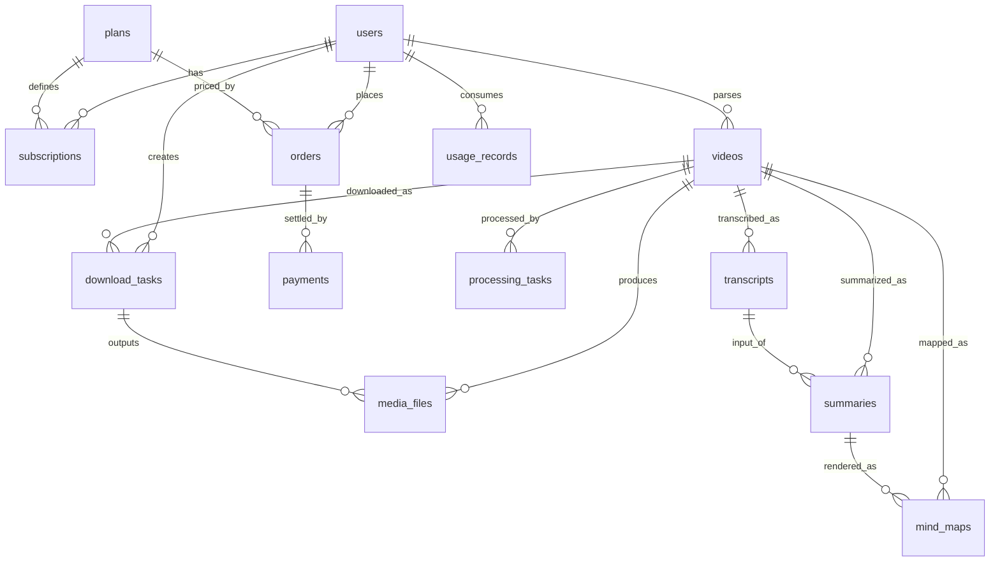

# 数据库设计

PostgreSQL 16。本文档是表结构与迁移规范的唯一事实来源，所有结构变更必须通过 Alembic migration 落地并同步更新本文档。

## 1. 通用规范

- 主键：`id UUID`，默认 `gen_random_uuid()`（启用 pgcrypto 扩展）。
- 时间戳：所有表含 `created_at` / `updated_at`（`timestamptz`，服务端默认值，应用层不手写）。
- 枚举：统一使用 `Enum(native_enum=False)`，即 varchar + CHECK 约束。禁止 Postgres 原生 ENUM（增删取值都要重写表，迁移成本高）。
- 金额：一律整型存储最小货币单位（`_cents`），禁止浮点。
- JSONB 用于结构会演进、不需要按内部字段查询的数据（formats、raw_info、features）。
- Model 层只描述结构与关系，不写业务逻辑；查询条件里的业务判断放 service 层。

## 2. ER 关系

## 3. 表定义

### users

| 字段 | 类型 | 说明 |
|------|------|------|
| id | uuid PK | |
| email | citext | 唯一索引，登录标识 |
| password_hash | varchar(255) | bcrypt |
| nickname | varchar(64) | |
| avatar_url | varchar(512) | nullable |
| is_active | bool | 默认 true，封禁置 false |
| is_admin | bool | 默认 false |
| last_login_at | timestamptz | nullable |

### plans

| 字段 | 类型 | 说明 |
|------|------|------|
| id | uuid PK | |
| code | varchar(32) | 唯一，如 `free` / `monthly` / `yearly` |
| name | varchar(64) | 展示名 |
| price_cents | int | 0 表示免费 |
| currency | char(3) | 如 `CNY` / `USD` |
| duration_days | int | 订阅时长；免费档为 NULL |
| features | jsonb | 权益矩阵，如 `{"audio_extract": true, "transcribe": true, ...}` |
| max_daily_downloads | int | 每日下载配额 |
| max_video_duration_seconds | int | 单视频时长上限 |
| is_active | bool | 下架不删行 |
| sort_order | int | 展示排序 |

`features` 的键集合由 `PermissionService` 定义并校验，新增权益先加键再开权益。

### subscriptions

| 字段 | 类型 | 说明 |
|------|------|------|
| id | uuid PK | |
| user_id | uuid FK → users | 索引：(user_id, status) |
| plan_id | uuid FK → plans | |
| status | enum: active / expired / cancelled | |
| started_at | timestamptz | |
| expires_at | timestamptz | 索引，到期任务扫描用 |
| auto_renew | bool | 默认 false |

判定当前权益：取 `status=active 且 expires_at > now()` 的最新一条；无则回落到 `free` plan。

### orders

| 字段 | 类型 | 说明 |
|------|------|------|
| id | uuid PK | |
| order_no | varchar(32) | 唯一，业务单号，对外暴露用这个而不是 id |
| user_id | uuid FK → users | 索引 |
| plan_id | uuid FK → plans | |
| amount_cents | int | 下单时从 plan 快照，不信任前端金额 |
| currency | char(3) | |
| status | enum: pending / paid / failed / expired / refunded | |
| paid_at | timestamptz | nullable |
| expired_at | timestamptz | 超时未支付由周期任务置 expired |

### payments

| 字段 | 类型 | 说明 |
|------|------|------|
| id | uuid PK | |
| order_id | uuid FK → orders | 索引 |
| provider | varchar(32) | 支付渠道 |
| provider_trade_no | varchar(128) | 渠道流水号 |
| amount_cents | int | |
| currency | char(3) | |
| status | enum: pending / success / failed | |
| paid_at | timestamptz | nullable |
| raw_payload | jsonb | webhook 原始报文，排查用 |

唯一约束 `(provider, provider_trade_no)`：webhook 重投时靠它保证幂等，重复通知不产生第二行。

### videos

| 字段 | 类型 | 说明 |
|------|------|------|
| id | uuid PK | |
| user_id | uuid FK → users | nullable（支持未登录解析），索引 |
| source_url | text | 用户提交的原始 URL |
| platform | varchar(32) | 如 `youtube` / `bilibili`，索引 (platform, platform_video_id) |
| platform_video_id | varchar(128) | 平台内视频 id |
| title | varchar(512) | |
| uploader | varchar(256) | nullable |
| thumbnail_url | varchar(1024) | nullable |
| duration_seconds | int | nullable |
| webpage_url | varchar(1024) | 规范化后的页面 URL |
| formats | jsonb | 可下载格式列表（format_id、清晰度、编码、大小） |
| raw_info | jsonb | yt-dlp 原始信息，排查用 |
| status | enum: parsing / ready / failed | |
| error_message | text | nullable |

### download_tasks

| 字段 | 类型 | 说明 |
|------|------|------|
| id | uuid PK | |
| user_id | uuid FK → users | nullable，索引 (user_id, status) |
| video_id | uuid FK → videos | 索引 |
| format_id | varchar(64) | 用户选择的 yt-dlp format |
| quality | varchar(32) | 展示用，如 `1080p` |
| status | enum: queued / downloading / processing / uploading / completed / failed / cancelled | 索引，监控与统计用 |
| progress | numeric(5,2) | 0–100，节流落库 |
| celery_task_id | varchar(64) | 取消时 revoke 用 |
| error_code | varchar(64) | nullable，取值见 api.md |
| error_message | text | nullable |
| retry_count | int | 默认 0 |
| started_at / finished_at | timestamptz | nullable |

### processing_tasks

AI 类异步任务（音频提取、转写、总结、思维导图）的统一任务表。与 download_tasks 分表：两者状态机不同、查询模式不同，硬塞进一张表会让字段大量可空。

| 字段 | 类型 | 说明 |
|------|------|------|
| id | uuid PK | |
| user_id | uuid FK → users | 索引 (user_id, status) |
| video_id | uuid FK → videos | 索引 |
| task_type | enum: audio_extract / transcribe / summarize / mindmap | |
| status | enum: queued / running / completed / failed / cancelled | 索引 |
| celery_task_id | varchar(64) | |
| output_id | uuid | nullable，产物 id（media_file / transcript / summary / mind_map） |
| error_code | varchar(64) | nullable，取值复用 api.md 错误码集合 |
| error_message | text | nullable |
| started_at / finished_at | timestamptz | nullable |

同一 video 同一 task_type 只允许一条非终态任务：重复触发时返回已有任务或已有产物，不重复执行。

### media_files

| 字段 | 类型 | 说明 |
|------|------|------|
| id | uuid PK | |
| owner_user_id | uuid FK → users | nullable，索引 |
| task_id | uuid FK → download_tasks | nullable（AI 产物不来自下载任务） |
| video_id | uuid FK → videos | nullable，索引 |
| kind | enum: video / audio / subtitle / thumbnail | |
| format | varchar(16) | mp4 / mp3 / m4a / srt ... |
| size_bytes | bigint | |
| duration_seconds | int | nullable |
| storage_backend | varchar(16) | 默认 `oss`，开发环境可为 `local` |
| storage_key | varchar(512) | 对象存储键 |
| expires_at | timestamptz | 索引，清理任务扫描用，强制非空 |
| deleted_at | timestamptz | nullable，软删除标记 |

### transcripts

| 字段 | 类型 | 说明 |
|------|------|------|
| id | uuid PK | |
| video_id | uuid FK → videos | 索引 |
| task_id | uuid FK → download_tasks | nullable |
| language | varchar(16) | ASR 识别结果 |
| text | text | 全文 |
| segments | jsonb | `[{start, end, text}]`，时间轴 |
| asr_engine | varchar(32) | 如 `faster-whisper:large-v3` |
| duration_seconds | int | |

### summaries

| 字段 | 类型 | 说明 |
|------|------|------|
| id | uuid PK | |
| transcript_id | uuid FK → transcripts | |
| video_id | uuid FK → videos | 索引 |
| provider | varchar(32) | LLM 供应商 |
| model | varchar(64) | 具体模型名 |
| summary | text | |
| key_points | jsonb | `string[]` |
| chapters | jsonb | `[{title, start, end}]` |
| keywords | jsonb | `string[]` |
| prompt_version | varchar(16) | prompt 迭代追溯 |

### mind_maps

| 字段 | 类型 | 说明 |
|------|------|------|
| id | uuid PK | |
| summary_id | uuid FK → summaries | |
| video_id | uuid FK → videos | 索引 |
| markdown | text | Markmap 兼容的层级 Markdown |

### usage_records

| 字段 | 类型 | 说明 |
|------|------|------|
| id | uuid PK | |
| user_id | uuid FK → users | 索引 (user_id, created_at)，配额与账单统计 |
| action | enum: download / audio_extract / transcribe / summarize / mindmap / ask | |
| ref_id | uuid | nullable，关联对象（task_id / video_id 等） |
| llm_input_tokens | int | 默认 0 |
| llm_output_tokens | int | 默认 0 |
| asr_seconds | int | 默认 0 |
| storage_bytes | bigint | 默认 0 |
| cost_cents | int | 按当时单价估算的成本，定价决策依据 |

配额统计口径：`action + created_at 当日` 聚合；成本统计口径：全字段按月聚合。

## 4. 迁移与初始化

- Alembic 使用异步引擎（asyncpg），`alembic/env.py` 从应用 config 读连接串，不单独维护一份。
- 初始 migration 一次建齐本文件第 3 节的全部 13 张表；pgvector 扩展与 `transcript_chunks` 表留到 Ask Video 阶段单独 migration。
- 提供 seed 脚本写入三个 plan：`free`（每日 3 次下载、时长上限 30 分钟、无 AI 权益）、`monthly`、`yearly`。具体数值是运营配置，写死在 seed 而不是代码里。
- 每个 migration 必须实现非空的 `downgrade()`，合并前本地执行一次 `upgrade head → downgrade -1 → upgrade head` 验证可逆。
